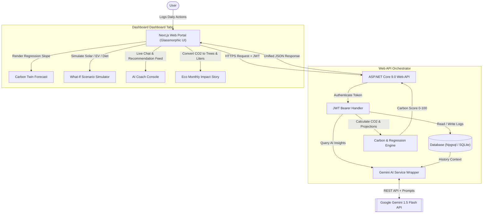

# EcoPilot AI — Carbon Twin & Coach Console 🍀

[](https://cloud.google.com/run)
[](https://nextjs.org/)
[](https://dotnet.microsoft.com/)
[](https://github.com/dotnet/efcore)
[](https://deepmind.google/technologies/gemini/)

EcoPilot AI is a premium, production-ready, containerized carbon tracking and AI-driven coaching platform. By combining a modern glassmorphic web dashboard (Next.js) with a high-performance Web API (ASP.NET Core 9.0) and advanced AI (Gemini 1.5 Flash), EcoPilot AI empowers users to calculate, forecast, and simulate how simple lifestyle changes impact their environmental footprint.

---

## 🔗 Live Deployed URLs
The application is fully deployed and active on Google Cloud Run:
* **Frontend Portal**: [https://ecopilot-web-964997501563.us-central1.run.app](https://ecopilot-web-964997501563.us-central1.run.app)
* **Backend API Base**: [https://ecopilot-api-964997501563.us-central1.run.app](https://ecopilot-api-964997501563.us-central1.run.app)
* **Interactive API Swagger Docs**: [https://ecopilot-api-964997501563.us-central1.run.app/swagger](https://ecopilot-api-964997501563.us-central1.run.app/swagger)

---

## 🗺️ System Data Flow
The flowchart below illustrates how daily activity logs propagate from the client, get evaluated by the backend carbon engine, feed through Gemini AI for optimization suggestions, and get forecasted using linear regression models.



---

## 🌍 Vertical and Persona Alignment
* **Vertical**: Advanced Personal Climate Navigation & Carbon Management.
* **Target Persona**: Eco-conscious individuals who want to take control of their lifestyle emissions. Rather than dealing with raw carbon weights, the system converts values into **tangible equivalents** (like virtual trees planted, vehicle fuel saved, or electricity cut percentages) and motivates improvement through a gamified level and streak system.

---

## 🚀 Key Modules & System Logic

### 1. Carbon Activity Tracker
Allows users to log:
* **Transportation**: Distance (km) on Car (Gasoline/Diesel/EV), Public Transit, Bicycle, or walking.
* **Energy Usage**: Household grid electricity (kWh), active AC cycles (hours), and count of active appliances.
* **Dietary Footprint**: Servings of meat, vegetarian options, and dairy consumed.
* **Shopping**: New clothes bought, electronics purchased, and household spending.
* **Waste Production**: Recycled, organic, and plastic waste weights (kg).

### 2. Carbon Twin (Digital Predictor)
Computes a digital twin representation comparing "Current You" vs "Future You":
* Evaluates historical check-ins using **Linear Regression Mathematics** to calculate the daily trend slope.
* Projects emissions **3, 6, and 12 months** into the future.
* Integrates Gemini to generate an explanatory summary explaining *why* the twin's forecast is moving in that direction.

### 3. What-If Simulator
An interactive panel to test carbon reduction scenarios:
* Instantly models effects of switching to an EV, installing solar panels, working from home, riding a bicycle, or limiting meat intake.
* Dynamically calculates projected annual CO₂ reductions and calculates the new potential Carbon Score.
* Queries Gemini to return physical-chemical explanations of the ecological mechanics behind the selected solutions.

### 4. Interactive AI Coach Chat
An AI-powered coaching experience:
* Feeds user's 7-day average carbon logs directly into the Gemini prompt as system context.
* Users can query the bot interactively about local recycling rules, recipes, energy saving tips, or smart home retrofits.
* The response is returned instantly as responsive Markdown.

### 5. Personalized Green Missions & Streaks
* Automatically recommends custom weekly missions based on the highest carbon emission category.
* Completing missions rewards experience points (XP) and points.
* Features a leveling-up system, profile badges, and daily streaks to build habit-forming engagement.

---

## 🛠️ Folder Structure & Architecture

```
Carbon-Footprint/
├── docker-compose.yml           # Local multi-container dev environment
├── Dockerfile.backend           # ASP.NET Core alpine builder
├── Dockerfile.frontend          # Next.js alpine builder
│
├── backend/                     # ASP.NET Core 9.0 Web API
│   ├── Controllers/             # Auth, Activity, Coach, Twin, Simulator, Missions
│   ├── Models/                  # Entity Framework schemas (User, Badge, Log)
│   ├── Data/                    # Database contexts (Npgsql & SQLite fallback)
│   ├── Services/                # CarbonEngine & Gemini Client Service
│   └── Program.cs               # DI setup, CORS rules, and database migrator
│
└── frontend/                    # Next.js App Router (TypeScript + CSS)
    ├── app/                     # Pages (/, /dashboard, Layout, Favicon)
    ├── components/              # Interactive cards, charts, and onboarding wizard
    └── utils/                   # api.ts (Fetch wrappers & authentication interceptors)
```

---

## 💻 Local Setup & Development

### 1. Quick SQLite Fallback
For rapid testing, the backend is configured to **auto-generate a local SQLite database (`ecopilot.db`)** if no PostgreSQL connection string is supplied in the configuration. 

### 2. Launch Backend (Web API)
From the `/backend` folder:
```powershell
dotnet restore
dotnet run --urls "http://localhost:8080"
```
The server will initialize `ecopilot.db` and host the endpoints at [http://localhost:8080](http://localhost:8080).

### 3. Launch Frontend (Next.js)
From the `/frontend` folder:
```bash
npm install
npm run dev
```
Open [http://localhost:3000](http://localhost:3000) to access the landing screen.

---

## 🐳 Docker Orchestrated Stack
To run the full stack locally with a PostgreSQL database, execute:
```bash
docker-compose up --build
```
This boots up Next.js on port `3000`, the .NET Web API on port `8080`, and a local PostgreSQL instance on port `5432` with preconfigured database migrations.

---

## ☁️ GCP Cloud Run Deployment Commands
To manually deploy or update changes to Google Cloud Run under Project ID `genai-498705`:

### 1. Build and Deploy Backend API
```bash
# Copy Dockerfile.backend to root Dockerfile
cp Dockerfile.backend Dockerfile

# Submit build to Cloud Build
gcloud builds submit --tag gcr.io/genai-498705/ecopilot-api .

# Deploy container to Cloud Run
gcloud run deploy ecopilot-api \
  --image gcr.io/genai-498705/ecopilot-api \
  --region us-central1 \
  --allow-unauthenticated \
  --port 8080 \
  --quiet

# Remove temporary root Dockerfile
rm Dockerfile
```

### 2. Build and Deploy Frontend Client
```bash
# Copy Dockerfile.frontend to root Dockerfile
cp Dockerfile.frontend Dockerfile

# Submit build to Cloud Build (injects Backend URL into NEXT_PUBLIC_API_URL environment)
gcloud builds submit --tag gcr.io/genai-498705/ecopilot-web .

# Deploy container to Cloud Run
gcloud run deploy ecopilot-web \
  --image gcr.io/genai-498705/ecopilot-web \
  --region us-central1 \
  --allow-unauthenticated \
  --port 3000 \
  --quiet

# Remove temporary root Dockerfile
rm Dockerfile
```
